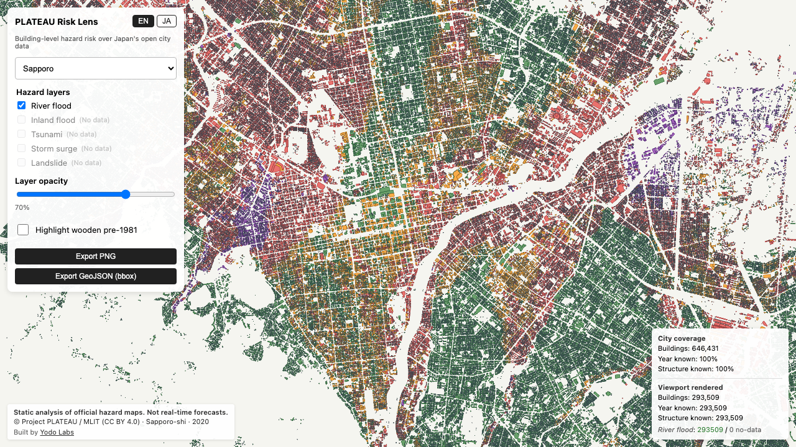
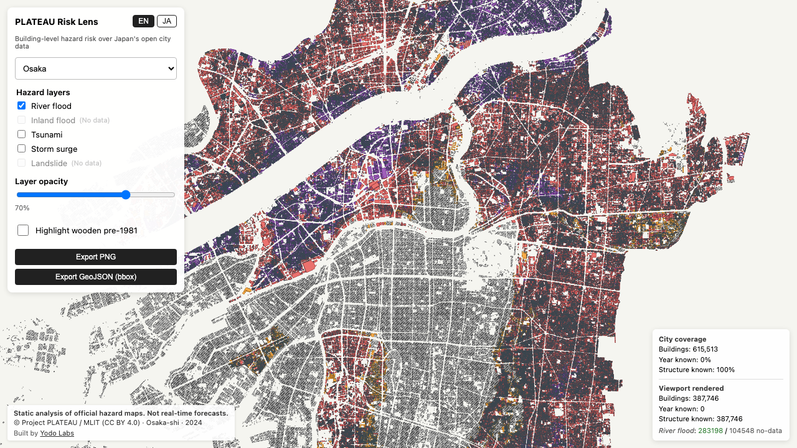
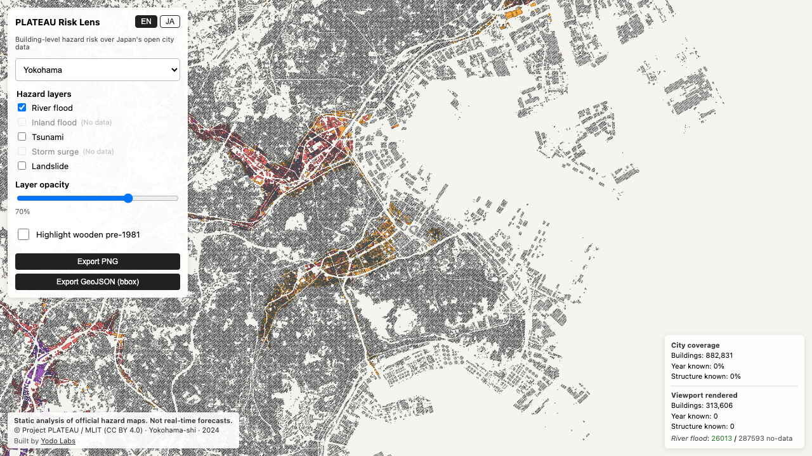
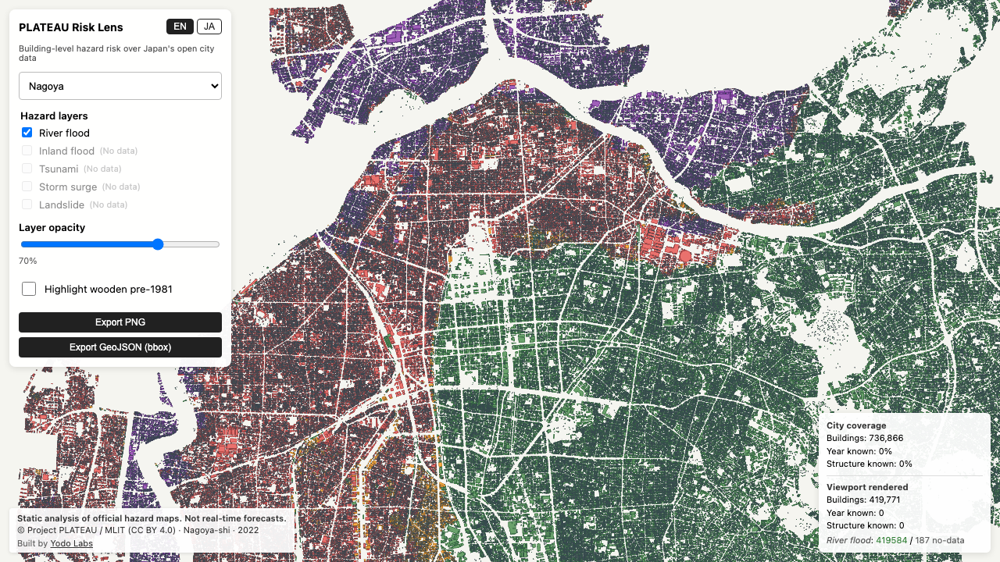

<p align="center">
  <a href="https://yodolabs.jp">
    
  </a>
</p>

<h1 align="center">plateau-risk-lens</h1>

<p align="center">
  <strong>PLATEAU オープンデータによる、静的・引用可能な災害リスク解説ツール。</strong><br/>
  リアルタイム予報システムでも、物理シミュレーションでもありません。
</p>

<p align="center">
  <a href="https://github.com/pixelx-jp/plateau-risk-lens/actions/workflows/ci.yml"></a>
  <a href="./LICENSE"></a>
  <a href="https://www.mlit.go.jp/plateau/"></a>
</p>

<p align="center">
  <a href="https://risk-lens.plateau.yodolabs.jp"><strong>🌐 ライブデモ →</strong></a>
  &nbsp;·&nbsp;
  <a href="./README.md">English README →</a>
</p>

<p align="center">
  <a href="https://risk-lens.plateau.yodolabs.jp">
    
  </a>
  <br/>
  <sub>札幌 — 646,431 棟、河川洪水の浸水深で 1 棟ごとに色分け。調査済みで安全な建物だけが緑になり、<strong>データなしはグレー斜線のまま、決して緑にはなりません</strong>。公的災害想定面の静的解析であり、リアルタイム予報ではありません。</sub>
</p>

---

PLATEAU の災害想定面（河川洪水・内水氾濫・津波・高潮・土砂災害の 5 種類）を、
建物単位で地図上に重ね合わせる純クライアント 2D MapLibre アプリです。
[plateau-core](https://github.com/pixelx-jp/plateau-bridge) が出力する
PMTiles + FlatGeobuf を読み込み、
**「データなし」を絶対に「安全」と誤読させない**厳格な三段階表示で描画します。

| 状態 | 表示 |
|---|---|
| `covered=false`（調査範囲外） | グレー + 斜線パターン — **絶対に緑にしない** |
| `coverage_confidence` が信頼値でない | 薄いグレー — **絶対に緑にしない** |
| `covered=true && depth_max ∈ {null, ≤0}` | 緑（安全） |
| `covered=true && depth_max > 0` | 深さに応じて 黄 → オレンジ → 赤 → 紫 |
| `landslide_in_zone=true` | 茶（土砂災害区域） |

リポジトリ内で最も重要な自動テストは、「データなし」の建物が「安全グリーン」の
ピクセルを Chromium / Firefox / WebKit のいずれでも生成しないことを保証します。
詳細：[`e2e/no-green-on-nodata.spec.ts`](./e2e/no-green-on-nodata.spec.ts)

## なぜこのツールが必要なのか

PLATEAU は、**建物単位の意味属性と複数の災害想定面ポリゴンを同時に公開している、
世界で唯一のオープンデータ**です。PLATEAU VIEW は GIS の専門家向けですが、
本ツールは一般市民・メディア・防災教育の現場向けに、シンプルで引用可能な
リスク解説を提供することを目的としています。「リアルタイム」を装ったり、
災害をゲーム化したりすることは絶対にしません。

設計思想とあえて実装しない機能の一覧：[`docs/DESIGN.md`](./docs/DESIGN.md)

## クイックスタート

```sh
git clone https://github.com/pixelx-jp/plateau-risk-lens
cd plateau-risk-lens
npm install
npm run dev   # → http://localhost:5173
```

災害データ（PMTiles + FGB）は別途用意してください。次の 3 通りから選択：

| 方式 | こんなときに | コマンド |
|---|---|---|
| **本番オリジン直結** | とりあえず動かしたい | `echo 'VITE_ARTIFACT_BASE_ROOT=https://artifacts.plateau.yodolabs.jp' > .env.local` |
| **ローカルにダウンロード** | オフライン作業 / 高速 dev | `scripts/fetch-artifacts.sh shibuya edogawa kamakura` |
| **plateau-core を sibling clone** | plateau-core 開発中 | このリポジトリの隣に `plateau-core/` を置く |

データバンドルは [plateau-core の GitHub Releases](https://github.com/pixelx-jp/plateau-bridge/releases/tag/data-v1) から取得します（1 都市 10–600 MB）。`.artifacts/` に展開され、`dist/` には含まれません。

## テスト

```sh
npm run typecheck     # tsc 型チェック
npm test              # vitest — 誠実性インバリアント + 純粋関数テスト 68 件
npm run test:e2e      # Playwright — スモーク + クロスブラウザビジュアルリグレッション
```

## デプロイ

メンテナは GitHub Actions 経由で Cloudflare Pages にデプロイします。
PR ごとのプレビューは自動生成されます。コントリビューターは Cloudflare アカウントも
`wrangler` のインストールも不要です。詳細は [`docs/DEPLOYMENT.md`](./docs/DEPLOYMENT.md) を参照。

## 技術スタック

- TypeScript + React 18
- MapLibre GL JS 5 + PMTiles（ベクタータイル、クリック時のフィーチャクエリ）
- FlatGeobuf（HTTP range query による全精度 bbox エクスポート）
- zustand（UI 状態管理）
- Vite 6 + Vitest 3 + Playwright

バンドルサイズ：初期 ~357 KB gzip。エクスポートモジュールは遅延ロード。

## 対象都市

東京 23 区すべて + 鎌倉市の計 24 都市。横浜・大阪・名古屋・福岡・札幌は
[plateau-core](https://github.com/pixelx-jp/plateau-bridge) でデータ生成済みで、
本番オリジンへの追加は順次対応します。追加方法は
[CONTRIBUTING.md](./CONTRIBUTING.md#adding-a-city) を参照。

<table>
  <tr>
    <td align="center" width="33%">
      <br/>
      <sub><strong>大阪</strong>・ダークモード・浸水深グラデーション</sub>
    </td>
    <td align="center" width="33%">
      <br/>
      <sub><strong>横浜</strong>・沿岸部の河川洪水リスク</sub>
    </td>
    <td align="center" width="33%">
      <br/>
      <sub><strong>名古屋</strong>・建物単位の浸水深</sub>
    </td>
  </tr>
</table>

<sub>どの都市でも三段階表示は同じ：データが「調査済みかつ安全」と示すときだけ緑、「調査データなし」はグレー斜線、計測された浸水深があるところはグラデーション。レイヤー切替・PNG / GeoJSON エクスポートは<a href="https://risk-lens.plateau.yodolabs.jp">ライブデモ</a>で。</sub>

## ライセンスと出典

- **ソースコード:** [MIT](./LICENSE)、© ピクセルエックス株式会社（PixelX Inc.）およびコントリビューター
- **災害データ:** © Project PLATEAU / 国土交通省（[CC BY 4.0](https://www.mlit.go.jp/plateau/)）

スクリーンショットおよびエクスポートされた GeoJSON にはすべて、データ出典の
表示と「本ツールはリアルタイム予報ではなく、公的災害想定面の静的解析である」
旨の免責が含まれます。**転載・引用の際は必ず原文の表示を残してください。**

## About

[Yodo Labs](https://yodolabs.jp)（ピクセルエックス株式会社 / PixelX Inc.）が
開発・運営する、日本の市民データ・防災データ基盤プロジェクトの一つです。

- ウェブサイト：<https://yodolabs.jp>
- メンテナ問い合わせ：[pan@yodolabs.jp](mailto:pan@yodolabs.jp)
- セキュリティ報告：[pan@yodolabs.jp](mailto:pan@yodolabs.jp)（公開 issue ではなくメールでお願いします）

### 関連プロジェクト

- [plateau-core](https://github.com/pixelx-jp/plateau-bridge) — 本ツールが読み込む
  PMTiles + FlatGeobuf + manifest を生成するパイプライン
- Yodo Labs では他にも PLATEAU 関連ツールを開発中です
